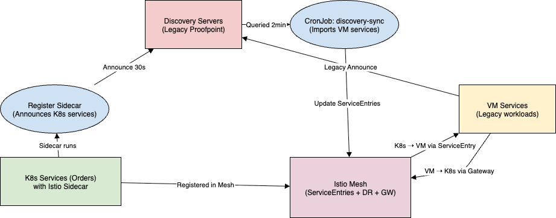

Discovery Service K8s + Legacy

Proofpoint’s discovery service is a distributed registry:

VM services periodically announce into discovery servers.

Clients query discovery servers and do client-side load balancing.

Announcements expire after 90s unless renewed.

Config of discovery servers is injected at deploy time, not runtime.

Problem Statement:
Migrate services into Kubernetes while ensuring:

  -> K8s services are still visible to VM clients.
  ->VM services are discoverable by K8s clients.

Solution 
1. K8s services register into Proofpoint discovery

A sidecar (discovery-register) runs alongside each K8s workload. It periodically announces into discovery servers (every 30s) using URLs from a ConfigMap. This keeps K8s services present in the legacy registry.

2. VM services are imported into Istio Service mesh

A CronJob (discovery-sync) queries discovery servers every 2 minutes. Results are translated into Istio ServiceEntries (so mesh can see VM endpoints). Combined with a DestinationRule, K8s clients can load-balance and fail over to VM instances.

3. Traffic management

DestinationRule (vm-services) applies ROUND_ROBIN LB + outlier detection across VM endpoints. Gateway + VirtualService expose K8s services (like orders) to VM clients via Istio ingress.

Files in this repo

orders-deployment.yaml → Orders app + registrar sidecar + Service.

discovery-sync.yaml → CronJob to import VM services into Istio.

destination-rule.yaml → LB & resiliency config for VM services.

